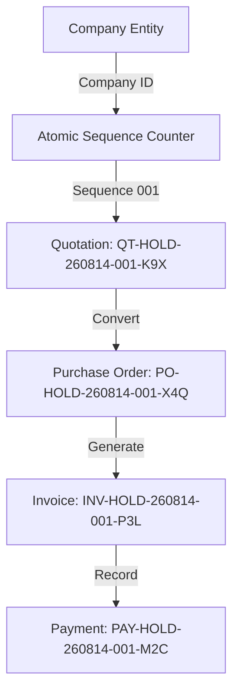

# Sec-DocuTrade Business Rules & Architectural Invariants

## Document Reference Generation & Immutability

### Architectural Invariant
> **Document references are immutable identifiers generated server-side from the owning company entity, document type, fiscal period, and atomic sequence. Company branding changes must never modify an existing document reference.**

### Core Numbering Rules
1. **Server-Side Authority**: Document reference numbers (e.g., `QT-HOLD-260814-001-K9X`) are generated exclusively on the server using atomic counter incrementation (`findOneAndUpdate` with `{ $inc: { sequenceValue: 1 } }`).
2. **Company Entity Scope**: Sequence allocation identity is conceptually `companyId + documentType + fiscalYear`. Counters are scoped by the authoritative legal owner (`companyId`) rather than purely human-readable code strings.
3. **Multi-Tenant Counter Isolation**: Two distinct companies sharing identical branding prefixes (e.g., `HOLD`) maintain completely separate sequence counters.
4. **Lifecycle Parity Across Document Chain**:
   - `Quotation` $\rightarrow$ `QT-CODE-YYMMDD-SEQ-HASH`
   - `Purchase Order` $\rightarrow$ `PO-CODE-YYMMDD-SEQ-HASH`
   - `Invoice` $\rightarrow$ `INV-CODE-YYMMDD-SEQ-HASH`
5. **Immutability Guarantee**: Once persisted to the database, a document's reference number (`quotationNumber`, `invoiceNumber`, `poNumber`) can never be altered by company code edits, logo updates, or branding configuration changes.

---

## Document Chain & Relationships

### Security & Concurrency Verification
- All document creation endpoints enforce atomic sequence reservation preventing race conditions under high concurrency.
- Enforced automated regression suite (`npm run test:numbering`) verifies 10/10 production document reference constraints prior to deployment.
